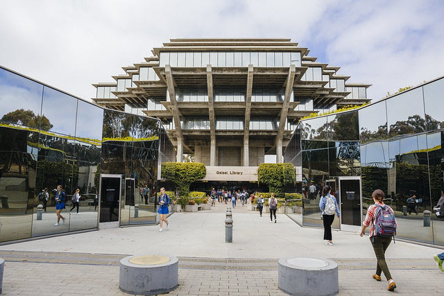

## welcome to cse110-lab01

todo for points:\
[x] pictures\
[x] links\
[x] all other core markdown constructs listed [here](https://docs.github.com/en/free-pro-team@latest/github/writing-on-github/basic-writing-and-formatting-syntax)\
--[x] headings\
--[x] styling text\
--[x] quoting text\
--[x] quoting code\
--[x] links\
--[x] section links\
--[x] relative links\
--[x] lists\
--[x] task lists\

optional:\
[x] github pages theme\
[] custom domain name for this page\
[] mentioning people and teams\
[] referencing issues and pull requests\
[] referencing external resources\
[] content attachments\
[x] using emoji\
[x] paragraphs\
[x] ignoring markdown formatting\

### picture
miss geisel and campus


### link
[link to this page](https://trinpham.github.io/cse110-lab01/)

### headings
# the largest heading
## the second largest heading
### the size used throughout the page
###### the smallest heading
####### could it go smaller?\
(no)

### styling text
**bold**\
__another way to bold__\
*italics*\
_another way to italicize_\
~~two squiqqlies for strike through~~\
***combo bold and italics***

### quoting text ###
> dont quote me on this

### quoting code ###
`quoting code` within text
```
chunk of code
line 2 of chunk of code
```
### links
Find the link to this website [here](https://trinpham.github.io/cse110-lab01/)

### section links
[Link](#section-links) to this section

### relative links
[Link to README](README.md)

### lists
unordered list
- eggs
- cheese
- ham

ordered list
1. eggs
2. cheese
3. ham

nested lists
1. first eggs
   - any eggs
     - white eggs
     - brown eggs

### task lists
- [x] should've used these for the to do list above
- [] change the to-do list above
- [x] complete the lab
- [x] \(optional) create an optional task

### using emoji
:star:

### paragraphs
hello to the ta/tutor reading this

hello again

### ignoring markdown formating
i dont want to \*italize\* this text
